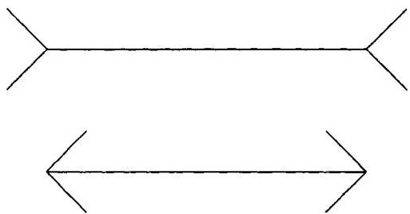

     1	# 5 Moral Knowledge
      	
     2	In the last three chapters, we have seen that moral claims are assertions about a class of irreducible, objective properties, which cannot be known on the basis of observation. How, if at all, can these claims be known? Is it rational to think any of these claims are true? In the present chapter, I explain how we can know or be justified in believing evaluative statements on the basis of ethical intuition.
      	
     3	## 5.1 The principle of Phenomenal Conservatism
      	
     4	Other things being equal, it is reasonable to assume that things are the way they appear. I call this principle 'Phenomenal Conservatism' ('phenomenal' meaning 'pertaining to appearances'). I have discussed the principle elsewhere, so here I will be relatively brief.¹
      	
     5	There is a type of mental state, which I call an 'appearance', that we avow when we say such things as 'It seems to me that p', 'It appears that p', or 'p is obvious', where p is some proposition. Appearances have propositional contents—things they represent to be the case—but they are not beliefs, as can be seen from the intelligibility of, 'The arch seems to be taller than it is wide, but I don't think it is'. Nevertheless, appearances normally lead us to form beliefs. 'Appearance' is a broad category that includes mental states involved in perception, memory, introspection, and intellection. Thus, we can say, 'This line seems longer than that one', 'I seem to recall reading something about that', 'It seems to me that I have a headache', and 'It seems that any two points can be joined by a single straight line'.² All of those statements make sense, using the same sense of 'seems'.
      	
     6	Appearances can be deceiving, and appearances can conflict with one another, as in the Müller-Lyer illusion:
      	
     7	
      	
     8	It initially seems that the top line is longer than the bottom line. But if you get out a ruler and measure them, you will find them to be of the same length. The top line will seem, when holding a ruler next to it, to be 2 inches long, and the bottom line will similarly appear to be 2 inches long. So, all things considered, it seems that the two lines are of the same length. As this example illustrates, an initial appearance can be overruled by other appearances (this does not mean the initial appearance goes away, but only that we don't believe it), and only by other appearances. Some appearances are stronger than others—as we say, some things are 'more obvious' than others—and this determines what we hold on to and what we reject in case of conflict. Presumably, it more clearly seems to you that the result of measuring the lines is accurate than that the result of eyeballing them is, so you believe the measurement result (this may have to do with background beliefs you have about the reliability of different procedures—which would themselves be based upon the way other things seem to you). Things can become complicated when many different beliefs and/or appearances are involved, but the basic principle is that we are more inclined to accept what more strongly seems to us to be true.
      	
     9	Appearances can be intellectual, as opposed to sensory, mnemonic, or introspective. It seems to us that the shortest path between any two points must be a straight line; that time is one-dimensional and totally ordered (for any two moments in time, one is earlier than the other); and that no object can be completely red and completely blue at the same time. I accept those things on intellectual grounds. I am not looking at all the possible pairs of points and all the possible paths connecting each pair and seeing, with my eyes, that the straight path is the shortest in each case. Instead, I am 'seeing' intellectually that it must be true—that is, when I think about it, it becomes obvious.
      	
    10	Logical judgments rest on intellectual appearances. We think the following inference logically valid (the premises entail the conclusion, regardless of whether the premises are true):
      	
    11	Socrates is a man.
      	
    12	All men are inconsiderate.
      	
    13	Therefore, Socrates is inconsiderate.
      	
    14	but the next one invalid:
      	
    15	Socrates is inconsiderate.
      	
    16	All men are inconsiderate.
      	
    17	Therefore, Socrates is a platypus.
      	
    18	We ‘see’ this, not with our eyes, but with our intellect or reason.
      	
    19	All judgments are based upon how things seem to the judging subject: a rational person believes only what seems to him to be true, though he need not believe everything that seems true.³ The function of arguments is to change the way things seem to one’s audience, by presenting other propositions (premises) that seem true and seem to support something (the conclusion) that may not initially have seemed true to the audience. An argument has force only to the extent that its premises seem true and seem to support its conclusion. Intellectual inquiry presupposes Phenomenal Conservatism, in the sense that such inquiry proceeds by assuming things are the way they appear, until evidence (itself drawn from appearances) arises to cast doubt on this. Even the arguments of a philosophical skeptic who says we aren’t justified in believing anything rest upon the skeptic’s own beliefs, which are based upon what seems to the skeptic to be true.
      	
    20	This indicates in brief why I take any denial of Phenomenal Conservatism to be self-defeating. Be that as it may, we have already laid down in chapter 1 that general philosophical skepticism is off the table in the present discussion. Since all judgment and reasoning presupposes Phenomenal Conservatism, a rejection of Phenomenal Conservatism amounts to a general philosophical skepticism. Therefore, we assume Phenomenal Conservatism to be correct.
      	
    21	## 5.2 Ethical intuitions
      	
    22	Reasoning sometimes changes how things seem to us. But there is also a way things seem to us prior to reasoning; otherwise, reasoning could not get started. The way things seem prior to reasoning we may
      	
    23	call an 'initial appearance'. An initial, intellectual appearance is an 'intuition'. That is, an intuition that $p$ is a state of its seeming to one that $p$ that is not dependent on inference from other beliefs and that results from thinking about $p$, as opposed to perceiving, remembering, or introspecting. An ethical intuition is an intuition whose content is an evaluative proposition.
      	
    24	Many philosophers complain either that they don't know what an intuition is or that the term 'intuition' is essentially empty and provides no account at all of how one might know something. I take it that these critics have just been answered.
      	
    25	Some question whether intuitions exist. We have seen some examples of intuitions in the previous section. Here are some examples in ethics:
      	
    26	Enjoyment is better than suffering.
      	
    27	If $A$ is better than $B$ and $B$ is better than $C$, then $A$ is better than $C$. It is unjust to punish a person for a crime he did not commit.
      	
    28	Courage, benevolence, and honesty are virtues.
      	
    29	If a person has a right to do something, then no person has a right to forcibly prevent him from doing that thing.
      	
    30	Prior to entertaining arguments for or against them, each of these propositions seems true. In each case, the appearance is intellectual; you do not perceive that these things are the case with your eyes, ears, etc. And they are evaluative. So the relevant mental states are ethical intuitions.
      	
    31	Here are some examples of ethical claims that, I take it, are not intuitive, even for those who believe them:
      	
    32	The United States should not have gone to war in Iraq in 2003.
      	
    33	We should privatize Social Security.
      	
    34	Abortion is wrong.
      	
    35	Though these propositions seem true to some, the relevant appearances do not count as 'intuitions' because they depend on other beliefs. For instance, the sense that the United States should not have invaded Iraq depends on such beliefs as that the war predictably caused thousands of deaths, that this is bad, that Iraq did not have weapons of mass destruction, and so on. This is not to deny that intuition has a role in one's coming to the conclusion that the U.S. should not have gone to war. It is intuition that tells us that killing people is prima facie wrong. Intuition is also involved in the weighing of competing values—for instance, we may have intuitions about
      	
    36	whether it is right to kill many people in order to depose a tyrant, if the facts of the case are as we believe them to be.
      	
    37	Some think that intuitions are just beliefs, and thus that ‘intuition’ does not name a way of knowing anything,⁸ for we do not want to say that merely by believing something, I know it. A more sophisticated worry is that what we think of as intuitions may be products of antecedently existing beliefs, perhaps via subconscious inferences. Perhaps ‘Enjoyment is better than suffering’ only seems true to me because I already believe it, or believe things from which it follows. There are two replies to these worries. First, the view that intuitions are or are caused by beliefs fails to explain the origin of our moral beliefs. Undoubtedly some moral beliefs are accounted for by inference from other moral beliefs. But since no moral belief can be derived from wholly non-moral premises, we must start with some moral beliefs that are not inferred from any other beliefs. Where do these starting moral beliefs come from? Do we just adopt them entirely arbitrarily? No; this is not the phenomenology of moral belief. We adopt fundamental moral beliefs because they seem right to us; we don’t select them randomly.
      	
    38	Second, moral intuitions are not in general caused by antecedent moral beliefs, since moral intuitions often either conflict with our antecedently held moral theories, or are simply unexplained by them. Here are two famous hypothetical examples from the ethics literature:
      	
    39	Example 1: A doctor in a hospital has five patients who need organ transplants; otherwise, they will die. They all need different organs. He also has one healthy patient, in for a routine checkup, who happens to be compatible with the five. Should the doctor kill the healthy patient and distribute his organs to the other five?
      	
    40	Example 2: A runaway trolley is heading for a fork in the track. If it takes the left fork, it will collide with and kill five people; if it takes the right fork, it will collide with and kill one person. None of the people can be moved out of the way in time. There is a switch that determines which fork the trolley takes. It is presently set to send the trolley to the left. You can flip the switch, sending the trolley to the right instead. Should you flip the switch?⁹
      	
    41	Most people’s intuitive answers are ‘no’ to example 1 and ‘yes’ to example 2. Some philosophers hold that the morally correct action is always the action with the best overall consequences. Their view implies that the answer to example 1 is yes. But even these philosophers, when confronted with the example, admit that their answer
      	
    42	is counter-intuitive, that it seems wrong to kill the healthy patient and harvest his organs.¹⁰ One's intuitions do not simply follow along with what one believes about morality. Relatedly, most people have difficulty explaining why they feel inclined to answer one way in example 1, and the opposite way in example 2; both cases introduce the possibility of sacrificing one person to save five. Philosophers have proposed various explanations of this (which remain controversial). The point is that no moral theory held prior to considering cases such as those above is likely to afford us an explanation for why the sacrifice should be found unacceptable in example 1 but acceptable in example 2.
      	
    43	The point that intuition is often independent of belief is important, since it enables intuition to provide the sort of constraint needed for adjudicating between competing moral theories. If intuition simply followed moral belief, then it could not help us decide which moral beliefs are correct. But this point is compatible with intuition's showing some degree of responsiveness to our beliefs, and I do not want to claim that a person's intuitions will in general remain entirely uninfluenced by the theories they adopt. Compare the observation that sensory perceptions are largely, but not entirely, independent of our background beliefs—for example, even if I believe Big Foot does not exist, if Big Foot should walk up to me, I will still see him.
      	
    44	Among intuitive moral propositions, some are more intuitive than others. Compare the above two examples to the following:
      	
    45	Example 3: As in example 2, except that there is no one on the right fork; if the trolley goes down the right fork, it will run into a pile of sand which will safely stop it. Should you flip the switch?
      	
    46	Everyone answers 'yes' to this one, even those who answered 'no' to example 2. Our intuitions about example 3 are clearer and more certain than those about examples 1 and 2. This gives the belief that you should flip the switch in example 3 a higher level of justification than the corresponding beliefs about examples 1 and 2.
      	
    47	Upon hearing these examples, some people try to deny the intuitions I have noted by posing such problems as: 'In example 1, what if the healthy patient is the future mother of Josef Stalin?' 'In example 3, what if the five people on the left fork are suicidal people who went there to get run over and are just going to go find some other way to kill themselves?' And when considering the intuition that enjoyment is better than suffering: 'What if the enjoyment is a sadistic or perverted pleasure?' The answer to all of these queries is
      	
    48	the same: I stipulate that those things are not the case. In all of my examples, all conditions are to be assumed normal unless otherwise specified; likewise, most moral principles have an implicit ‘in normal conditions’ clause. The purpose of considering such examples is not to initiate a legalistic exercise in searching for loopholes in a statement and ways of filling such loopholes. Our present aim is simply to show the existence and nature of ethical intuitions.
      	
    49	Not all intuitions are equal—some are more credible than others. As the above remarks suggest, one reason for this is that some intuitions are simply stronger, or more clearly seem true, than others. Another reason is that some intuitions are more widely shared than others; other things being equal, an intuition that many disagree with is more likely to be an error than is an intuition that nearly everyone shares. Another reason is that some intuitions have simpler contents than others, and are therefore less prone to error. And there are various reasons why some kinds of intuitions may be more open to bias than others. These facts point to the conclusion that intuitions should not be embraced uncritically, and that conflicting intuitions should be weighed against each other taking into account our best judgments as to their relative levels of reliability. I shall return to this point in the following chapter, when we come to the question of resolving ethical disagreements (sections 6.4 and 6.6).
      	
    50	### 5.3 Misunderstandings of intuitionism
      	
    51	The intuitive propositions we’ve been discussing are *prima facie* justified. That is, we are justified in believing them unless countervailing evidence should arise that is strong enough to defeat the initial presumption in their favor. Such defeating evidence would consist either of evidence directly against the proposition that intuitively seemed true, or of evidence that our initial intuition was unreliable.
      	
    52	We can now see that at least one objection to intuitionism rests on a misconstrual of the doctrine. Karl Popper writes:
      	
    53	‘Intuitionism’ is the name of a philosophical school which teaches that we have some faculty or capacity of intellectual intuition allowing us to ‘see’ the truth; so that what we have seen to be true must indeed be true. It is thus a theory of some authoritative source of knowledge.
      	
    54	He goes on to criticize intuitionism on the grounds that intuitions can be mistaken and we should remain open to revising our ethical
      	
    55	views.¹¹ Presumably he thinks intuitionists deny those things, but few if any intuitionists have done so, nor is there any reason why they should.¹² The same misunderstanding may be behind the occasional charge that intuitionism is ‘dogmatic’.¹³ I do not wish to rule out (as Popper does) the possibility of some intuitions’ being infallible; I simply deny that they must be infallible.
      	
    56	Tara Smith misunderstands intuitionism as the view that all moral truths are ‘self-evident’. In fact, intuitionists hold *at most* that some moral truths are self-evident,¹⁴ and my own form of intuitionism holds only that some moral beliefs are rendered *prima facie* justified by intuitions. Thus, no problem for intuitionism is generated by citing examples of moral principles that rest on reasoning, nor by citing moral principles that are less than 100 per cent certain. Nor does intuitionism assert ‘the irrelevance of argument’ in general.¹⁵ Once we have a fund of *prima facie* justified moral beliefs to start from, there is great scope for moral reasoning to expand, refine, and even revise our moral beliefs, in exactly the manner that the contemporary literature in philosophical ethics displays.
      	
    57	Admittedly, critics of intuitionism have not been without excuse in the above misunderstandings.¹⁶ H. A. Prichard, a major figure in twentieth-century intuitionism, at least invited them, and perhaps in his case they were not even misunderstandings:
      	
    58	This realization of [our obligations’] self-evidence is positive knowledge, and so far, and so far only, as the term Moral Philosophy is confined to this knowledge and to the knowledge of the parallel immediacy of the apprehension of the goodness of the various virtues and of good dispositions generally, is there such a thing as Moral Philosophy.¹⁷
      	
    59	His use of the term ‘self-evidence’ encourages Popper’s reading (though in fact he says all he means by ‘self-evident’ is ‘non-derivative’), and the rest of the passage encourages Tara Smith’s reading. But—leaving aside the interpretive question—a philosopher discussing a theory should address the strongest version of the theory, not the weakest. Granting the justification, on the basis of intuition, of common sense moral principles, there is no motivation stemming from any core assumption of intuitionism for denying that moral philosophy can construct further arguments, arriving at moral truths not immediately evident. The analogy Prichard draws with mathematics should if anything suggest to us that derivative items of ethical knowledge might far outnumber intuitive ones.
      	
    60	Some may think that the *foundationalism* of intuitionism requires
      	
    61	a doctrine of infallibility: that is, the idea that we can start from some moral principles, without having to justify them by argument, implies that those moral principles must be infallible, incorrigible, or the like. I have never been able to get anyone to tell me why this would be so.¹⁸ Why may we not hold our starting points open to revision in the event that tensions arise with other justified beliefs? Suppose I seem to see a glass of water on the table. That is enough for me to be justified in believing there is a glass of water, in the absence of any countervailing evidence. However, I may still hold this open to revision: if I reach for the ‘glass’ and find my hand passing through it, and if a dozen other people in the room say there is no glass there, I may decide there wasn’t a glass there after all. As this example illustrates, we normally take perceptual beliefs to be *prima facie* justified, just as the principle of Phenomenal Conservatism dictates. There is no obvious obstacle to holding intuitive beliefs to be justified similarly.
      	
    62	## 5.4 Common epistemological objections
      	
    63	### Objection 1:
      	
    64	We need reasons for believing our ethical intuitions, or the faculty of intuition in general, to be reliable. Otherwise, intuitions cannot justify our moral beliefs.¹⁹
      	
    65	### Reply:
      	
    66	What happens if we apply the principle generally: ‘We need positive reasons for trusting appearances’? Then we need positive reasons for trusting sense perception, memory, introspection, even reason itself. The result is global skepticism. Nothing can be accepted until we first give a positive reason for trusting that kind of belief. But we cannot give such a reason without relying on sense perception, memory, introspection, reason—or in general, on *some* source. Hence, we shall never be able to trust anything.²⁰ Of course, this means we also could not trust the reasoning of this paragraph.
      	
    67	We have stipulated that general philosophical skepticism is not our concern. We are not interested here in discussing the view that no one can know moral truths because no one can know anything whatsoever. One might try avoiding the skeptical threat by recourse to a coherence theory of justification, according to which beliefs are justified by their relations of mutual support with each other, rather than being built up from independently-justified foundations. In my view, there are compelling objections to such a theory, but I cannot discuss them here.²¹ For present purposes, let it suffice to say that if
      	
    68	such a theory can succeed in accounting for the justification of our other beliefs, there is no apparent reason why it could not also vindicate moral beliefs. Moral beliefs can mutually support each other as well as any other kind of belief. One might worry about how moral intuition would be worked into such a theory—but then, one might equally well worry about how perception would be worked into the coherence theory. If the coherentist can somehow accommodate the role of perception in the justification of our empirical beliefs, it is unclear why he could not accommodate intuition similarly.
      	
    69	But I don't think proponents of this first objection intend to endorse either coherentism or skepticism in epistemology. Rather, they believe intuition is somehow special, in a way that subjects it to a general demand for justifying grounds, a demand from which perception, memory, introspection, and reasoning are exempt. In view of the principle of Phenomenal Conservatism, it is obscure why this should be so; intuitions are just another kind of appearance, along with perceptual experiences, memory experiences, and so on. Furthermore, we saw examples in section 5.1 of non-moral intuitions that, I take it, nearly everyone would accept. If one accepts those intuitions, it would seem arbitrary not to accept ethical intuitions as well, at least prima facie.
      	
    70	## Objection 2:
      	
    71	The problem with intuitions is that we can never check whether an ethical intuition is correct, without relying on intuition.²² In contrast, empirical beliefs can often be checked by other means. If I doubt whether the table I see is real, I can test this by trying to touch it, by asking other people if they also see it, or trying to put a glass on it.
      	
    72	## Reply:
      	
    73	There are three replies to this objection. First, the objection sounds suspiciously like Objection 1. If we take beliefs to be *prima facie* justified on the basis of appearances, then it is unclear why intuitive beliefs should be thought to require checking, in the absence of any positive grounds for doubting them. If, on the other hand, we reject this conception of *prima facie* justification, then it is unclear how one is supposed to check anything. If belief A has no *prima facie* justification, and belief B also has no *prima facie* justification, then one can not legitimately ‘check on’ or ‘verify’ A’s truth by appealing to B. Unless we are allowed to take something for granted, nothing can count as verifying anything.
      	
    74	Second, it is doubtful that all of our non-moral knowledge can be checked in the sense required by the objection. I believe I have
      	
    75	mental states—beliefs, desires, feelings, and so on—because I (seem to) have introspective awareness of them. I am not sure how I would go about checking on the reliability of introspection by non-introspective means, and I do not believe I have ever done so. Nevertheless, it is quite certain that I have mental states. Likewise, it is unclear how I might go about checking on the general reliability of memory, without relying on memory; on the reliability of inductive reasoning, without relying on induction; or on the reliability of reason in general, without relying on reason.²³ Even the examples given in the statement of the objection might not count as checking an empirical belief by other means—if the belief that there is a table here is classified as being based on ‘sense perception’, then all the suggested means of verifying the belief rely on the same source. This objection, then, is in danger of devolving into general philosophical skepticism.
      	
    76	Third, if one takes a liberal view of what counts as checking a belief—as one must in order to allow most non-moral beliefs to be ‘checked’—then it appears that intuitions can be checked. I can check my belief that murder is wrong by asking other people whether murder also seems wrong to them. If it is legitimate, as surely it is, to check a perceptual belief in this way, then why should this not be an equally valid check on an intuitive belief? One can also check an intuitive belief by seeing whether it coheres with other intuitive beliefs, just as one can check a perceptual belief by seeing whether it coheres with other perceptual beliefs. Thus, suppose someone reports an intuition that abortion is wrong. He may check on this by (a) seeing whether his intuition coheres with the intuitions of others, and (b) seeing whether his intuition about abortion coheres with his intuition about, say, Thomson’s violinist case.²⁴ These sorts of tests are nontrivial—many intuitions fail them, though many others pass. It is not as though the intuitionist immediately refers every moral question to intuition, with no possibility of further discussion or reasoning.
      	
    77	## Objection 3:
      	
    78	If we allow moral beliefs to be rested on mere appeals to intuition, then anyone can claim any moral belief to be justified. ‘If Thelma could be noninferentially justified in believing that eating meat is wrong, then Louise could also be noninferentially justified in believing that eating meat is not wrong, even if neither can infer her belief from any reason.’²⁵
      	
    79	## Reply:
      	
    80	When one perceives a physical object, one is *prima facie* justified
      	
    81	in believing some things about the object, things that can be perceptually discerned. It does not follow from this that any arbitrarily chosen claim about the physical world is justified. Likewise, I hold that when one has an ethical intuition, one is *prima facie* justified in believing the relevant evaluative proposition; it does not follow from this that any arbitrarily chosen evaluative proposition is justified.
      	
    82	Perhaps the point is that Louise would be justified in thinking that eating meat is not wrong, *if* she were to have a corresponding ethical intuition. Granted, this follows from my theory. It is also true that *if* someone *were* to look up at the sky and have a visual experience of redness, then they would be *prima facie* justified in believing that the sky is red. What is the problem?
      	
    83	Perhaps the objection relies on the assumption that many people in fact *do* have the intuition that eating meat is not wrong. This would be a problem for someone who wants to maintain that eating meat is wrong, just as it would be a problem for someone who thinks the sky is blue if many people looked up and saw different colors. If this is the objection, then it falls under the heading of the argument from disagreement, to be discussed in chapter 6.
      	
    84	One thing that is *not* a problem for the intuitionist is the possibility of people who indiscriminately claim to have intuitions, perhaps because they don’t feel like stating the actual reasons for their beliefs. We have no general technique for forcing people to be sincere and careful. This is regrettable. But it has no bearing on the reality of intuition or its validity as a source of knowledge. Analogously, eyewitnesses can and do exaggerate, make hasty judgments, and outright lie. No one thinks this refutes the validity of sense perception as a means of knowledge. Nor do we charge the philosopher of perception with the task of stopping people from doing those things. No more, then, is it the job of the ethical intuitionist to produce a technique for forcing everyone to be circumspect and honest in their value claims.
      	
    85	## Objection 4:
      	
    86	John Mackie calls ethical intuition ‘queer’ and ‘utterly different from our ordinary ways of knowing everything else’. ‘None of our ordinary accounts of sensory perception or introspection or the framing and confirming of explanatory hypotheses or inference or logical construction or conceptual analysis, or any combination of these’ can explain ethical knowledge.²⁶
      	
    87	Reply:
      	
    88	Given the reality of intuition in general, ethical intuition is not very different at all from other kinds of intuition. The only difference between ethical intuitions and non-ethical intuitions is in what they are about—and that cannot be taken as grounds for the queerness Mackie sees, unless we are to reject ethical knowledge merely for being ethical.
      	
    89	Doubtless Mackie would say it is intuition in general that is weird and utterly different from other means of knowing. It is conspicuously absent from his list of our 'ordinary' ways of knowing things. But it is no argument against intuitive knowledge to say that it cannot be accounted for by any of the non-intuitive means we have of knowing things.²⁷ One might as well argue that perception is queer, since perceptual knowledge cannot be accounted for by introspection, intuition, conceptual analysis, or reasoning. The fact is that Mackie has identified no specific feature of intuition that would render it problematic. One suspects that his reference to the 'queerness' of moral knowledge lacks cognitive meaning, serving rather to express his own aversion to such things than to describe any objective feature of it.²⁸
      	
    90	Behind Mackie's distaste for intuition there no doubt lies some of the strong empiricist sentiment of twentieth-century philosophy. Empiricism—roughly, the idea that all 'informative' knowledge, or knowledge of the mind-independent, language-independent world, must derive from sense perception—has been fashionable for the last century, though less so, I think, in the past decade. I cannot do justice to this subject here; nevertheless, I will briefly report how things seem to me. First, it is so easy to enumerate what appear on their face to be counter-examples to the thesis of empiricism, and at the same time so difficult to find arguments for the thesis, that the underlying motivation for the doctrine can only be assumed to be a prejudice. Second, I think that in the last several years, if not earlier, the doctrine has been shown to be untenable.²⁹ Here, I will give two of the better-known counter-examples to empiricism.
      	
    91	First example: Nothing can be both entirely red and entirely green.³⁰ How do I know that? Note that the question is not how I came upon the concepts 'red' and 'green', nor how I came to understand this proposition. The question is why, having understood it, I am justified in affirming it, rather than denying it or withholding judgment. It seems to be justified intuitively, that is, simply because it seems obvious on reflection. How else might it be justified?
      	
    92	A naive empiricist might appeal to my experiences with colored objects: I have seen many colored objects, and none of them have
      	
    93	ever been both red and green. One thing that makes this implausible as an explanation of how I know that nothing can be both red and green is the necessity of the judgment. Contrast the following two statements:
      	
    94	Nothing is both green and red.
      	
    95	Nothing is both green and a million miles long.
      	
    96	We have never observed a counter-example to either statement, so it would seem that the second is at least as well-supported by observation as the first. The second statement is probably true, since we have never observed a green object that is a million miles long, although there seems to be no reason why there couldn't be such a thing. We have a clear conception of what it would be like to observe such a thing, and it would not be senseless to look for one. But the first statement is different: we can see that there simply couldn't be a green object that is red, and it seems that no matter what our experience had been like, we would not have said that there was such an object; consequently, it would be senseless even to look for one. These points are difficult to square with the contention that both statements are justified in the same way, by the mere failure to observe a counter-example. Furthermore, suppose it turned out that all or most of your observations of colored objects have been hallucinatory (perhaps, like Neo, you learn that you are living in the Matrix). According to the present empiricist account, you would then have to suspend judgment on whether, in the real world, red objects are sometimes also green. This seems absurd.
      	
    97	For this sort of reason, most of those sympathetic to empiricism are more inclined to claim instead that 'Nothing can be both red and green' is somehow made true by virtue of the definitions of 'red' and 'green'. This is often thought to be an acceptable way of avoiding reliance on intuition. But it is not enough just to make this kind of claim; to make good on it, the empiricist must produce the definitions of 'red' and 'green' together with the actual derivation, from those definitions, of the statement 'Nothing can be both red and green'. No one has done this; indeed, the project seems stymied at stage one by the absence of any analytical definition of either 'red' or 'green'. It is here that some are tempted to appeal to scientific knowledge about the underlying nature of colors to construct definitions (saying, for example, 'red is the disposition to reflect such-and-such wavelengths of light'). But this approach leads to the absurd consequence that, say, 300 years ago, people were in no position to know whether it was possible for a red object to be green—indeed, did not even
      	
    98	understand the meanings of those words—since they did not know the scientific theory of colors.
      	
    99	Second example: I know that ‘Socrates is a man’ and ‘All men are chauvinists’ together entail ‘Socrates is a chauvinist’. How do I know that? One might say I know it because I know a general rule that all inferences of the form ‘x is an A; all A’s are B; therefore, x is B’ are logically valid—but, in the first place, this would only push the question to how I know that rule to be valid, and in the second place, it would only introduce another inference I have to make: ‘All inferences of such-and-such form are valid; this inference is of that form; therefore, this inference is valid’. So that is no help. Nor should one say that logical judgments in general are based on arguments, since the validity of the latter arguments would then have to be ascertained, leading to a problem of circularity or infinite regress.³¹ Nor, finally, are logical judgments known by observation—the validity of a piece of reasoning is not seen with the eyes, heard with the ears, etc. It seems that intuition is the only remaining possibility. Moreover, upon introspecting, we notice that we do in fact have logical intuitions, and that they do in fact make us think some inferences to be valid.
      	
   100	This sort of example is particularly interesting, since all reasoning depends upon principles of logic. Any kind of reasoning thus depends upon intuition, including the reasoning the reader is doing at the moment, and including any reasoning that might be deployed to impugn the reliability of intuition.
      	
   101	One possible response to this argument is that we need not have a priori knowledge of truths of logic, such as that a given inference is valid; instead, it would be enough for us to have an innate disposition to make valid inferences. While this response may undermine the claim that all reasoning depends upon intuitions, it does not obviate the need for intuition at some stage, for the simple reason that we do in fact know the principles of logic, and this knowledge must still be accounted for. I take it that one cannot, without some undesirable form of circularity, argue that a certain inference form is valid using an argument of that very form; hence, the point remains that knowledge of the rules of inference cannot in general be inferential.
      	
   102	As with the previous example, some would argue that the rules of logic are made true ‘by definition’ or by some sort of conventions. The idea that the truth of the laws of logic is convention-dependent would seem to suggest that we could have made conventions or stipulations in such a way that (without changing the meanings of
      	
   103	any of the following words), the following inference would have been invalid:
      	
   104	Socrates is a man.
      	
   105	All men are mortal.
      	
   106	Therefore, Socrates is mortal.
      	
   107	and the following would have been valid:
      	
   108	Socrates is a man.
      	
   109	Therefore, Socrates is immortal.
      	
   110	For Socrates’ sake, I think we should shift to conventions of that kind.
      	
   111	We could, of course, change the use of the word ‘valid’ by convention. But that is irrelevant; we could similarly change the use of the word ‘teeth’ by convention, but no one takes this to show that the fact that sharks have teeth is in any relevant sense conventional. (If you are ever pursued by a shark, I do not advise you to pin your hopes on a timely change in linguistic conventions.) Any true statement could be converted to a false one by a suitable change in the meanings of the words it contains. The question is whether the fact that the statement expresses is dependent on a convention—that is, whether, once the meaning of the statement is fixed, convention plays some further role in determining whether what is said is true. The test of that is whether we could render the statement false by a change in some convention, without changing what the statement means.³² For example, consider:
      	
   112	A. People in the United States drive on the right-hand side of the road.
      	
   113	Statement (A) is made true by convention in a substantive sense: there is a convention beyond those determining the meanings of the words in (A) that goes into making (A) true, namely, our convention of driving on the right side of the road. If we eliminated this convention, (A) would be rendered false, with no change in its meaning. Now contrast:
      	
   114	B. The syllogism, ‘Socrates is a man; all men are chauvinists; therefore, Socrates is a chauvinist’, is valid.
      	
   115	Statement (B) is obviously not convention-dependent in that way.
      	
   116	The meanings of the words in (B) depend on conventions, as is the case with all statements. But no other conventions are relevant to the truth of (B). We cannot render (B) false by changing any conventions, without changing the meaning of (B). The same is true of all logical principles. The laws of logic are thus examples of non-conventional, objective facts that are known independently of experience.
      	
   117	That will have to do for an overview of some of the difficulties for empiricism. Others have dealt with this issue more thoroughly and conclusively. But this should suffice to make clear why Mackie is not entitled to take empiricism for granted as a premise from which to attack intuitionism.
      	
   118	## 5.5 The implausibility of nihilism: a Moorean argument
      	
   119	Nihilism holds that nothing is good, bad, right, or wrong. I have said enough to show why we are *prima facie* justified in rejecting this. A nihilist might accept this point but maintain that there are nevertheless strong arguments for nihilism that overcome the initial presumption against it.³³ In the last section we saw some objections a nihilist might raise against realism, and we will see others in later chapters. What I argue in this section is that the presumption against nihilism is very strong, so that the arguments for nihilism would have to be extremely powerful to justify the nihilist’s position.
      	
   120	So far, I have focused on the qualitative point that many moral beliefs have *prima facie* justification. But justification comes in degrees: my justification for thinking that China exists is stronger than my justification for thinking that the theory of evolution is true, which is stronger than my justification for thinking that tomorrow will be sunny. What determines the *degree* to which an intuitive belief is *prima facie* justified? If one accepts Phenomenal Conservatism, the natural view to take is that the more obvious something seems, the stronger is its *prima facie* justification. Very clear and firm intuitions should take precedence over weak or wavering intuitions.
      	
   121	Now consider in outline one of the arguments for nihilism:
      	
   122	1. Moral good and bad, if they exist, would be intrinsically motivating—that is, things that any rational being would necessarily be motivated to pursue (in the case of good) or avoid (in the case of bad).
   123	2. It is impossible for anything to be intrinsically motivating in that sense.
   124	3. Therefore, good and bad do not exist.³⁴
      	
   125	More needs to be said to properly assess each of those premises, but I won't say it now. Right now I just want to use this argument to illustrate a general epistemological point. Given the nihilist conclusion in (3), one could validly infer such further conclusions as:
      	
   126	4. It is not the case that a nuclear war would be bad.
   127	5. It is never the case that enjoyment is better than excruciating pain.
      	
   128	And so on.
      	
   129	Now, just as someone who accepted (1) and (2) might be moved by the above reasoning to accept (4) and (5), a realist might argue against (1) and (2) as follows:
      	
   130	1'. A nuclear war would be bad.
   131	2'. Enjoyment is sometimes (if not always) better than excruciating pain.
   132	3'. Therefore, good and bad do exist.
   133	4'. Therefore, either
      	
   134	a. Good and bad need not be intrinsically motivating, or
   135	b. It is possible for something to be intrinsically motivating.
      	
   136	Some would charge this realist argument with 'begging the question' against nihilism, since premises (1') and (2') are precisely what the nihilist denies in his conclusion. But this embodies a naive conception of the burdens of dialectic, granting a presumption to whichever argument happens to be stated first. For if the realist argument had been stated first, then we could presumably say that the nihilist argument 'begs the question' against the realist since its premises (1) and (2) (conjointly) are precisely what the realist denies in his conclusion. The relationship between the two arguments is symmetric: each argument takes as premises the denial of the other argument's conclusion.[35] How, then, should we decide between them?
      	
   137	The strength of an argument depends upon how well justified the premises are and how well they support the conclusion. Both of the above arguments support their conclusions equally well—both are deductively valid. So of the two arguments, the better is the one whose premises are more initially plausible. Now which seems more obvious: 'Enjoyment is better than excruciating pain' or 'It is impossible for anything to be intrinsically motivating'? To me, the former seems far more obvious. And I do not think my judgment on this point is idiosyncratic. Therefore, it would be irrational to reject the former proposition on the basis of the latter.[36]
      	
   138	To justify his position, the nihilist would have to produce premises more plausible than any moral judgment—more plausible than ‘Murder is wrong’, more plausible than ‘Pain is worse than pleasure’, and so on. But some moral judgments are about as plausible as anything is. So the nihilist’s prospects look very bleak from the outset.
      	
   139	Finally, a comment on philosophical method. The nihilist argument above, as well as the empiricist argument discussed earlier (section 5.4, Objection 4), evince a kind of rationalistic methodology common in philosophy. The method is roughly this: begin by laying down as obvious some abstract principle of the form, ‘No A can be B’. (For example, ‘No substantive knowledge can be a priori’; ‘No objective property can be intrinsically motivating’; ‘No unverifiable statement can be meaningful’.) Then use the general principle as a constraint in the interpretation of cases: if there should arise cases of A’s that for all the world look like B’s, argue that they cannot really be B’s because that conflicts with the principle, and seek some other interpretation of the cases. One of the great ironies of philosophy is that this rationalistic methodology is commonly employed by empiricists. One might have expected them to adopt the opposite approach: start by looking at cases, and only form generalizations that conform to the way all of the cases appear; stand ready to revise any generalizations upon discovery of counter-examples; treat the cases as a constraint on the generalizations.
      	
   140	My method is something between those two: begin with whatever seems true, both about cases and about general rules. If conflicts arise, resolve them in favor of whichever proposition appears most obvious. Roughly speaking, we want to adopt the coherent belief system that is closest to the appearances, where fidelity to appearances is a matter of how many apparently-true propositions are maintained, with these propositions weighted by their initial degree of plausibility. We can call this the method of reflective equilibrium.³⁷,³⁸ The method of reflective equilibrium leads us to endorse some moral judgments. It is highly unlikely that it could ever lead us to endorse nihilism, as the latter requires a rejection of our entire body of moral beliefs. Indeed, it would be hard to devise a theory less faithful to the appearances.
      	
   141	## 5.6 Direct realism and the subjective inversion
      	
   142	I turn to another epistemological objection to intuitionism, which will help clarify intuition’s role in producing knowledge. Consider a pair of statements of the form,
      	
   143	1. $S$ has an intuition that $p$.
   144	2. $p$.
      	
   145	where $S$ is some person and $p$ is some proposition. The intuitionist claims that (1) plays some role in the justification of (2) (at least for $S$). But how? Not only does (1) fail to logically imply (2), but they typically do not even belong to the same subject matter. Suppose $p$ is the proposition that the shortest path between two points is a straight line. Then (2) is a geometrical statement; it says something about the structure of space. (1) is not a geometrical but a psychological statement; it says only that someone has a certain mental state. What relevance could (1) possibly bear to (2)?
      	
   146	Things would be alright if we could argue that, notwithstanding their logical independence, (1) renders (2) more probable. But how would the occurrence of some mere subjective mental state render probable a proposition about the external world? The obvious suggestion is that it would do so if we had reason to believe the mental state was a sign of the external fact—in other words, that in general, when $S$ has an intuition that $p$, $p$ is usually true. In order to ascertain that, it seems that we would need to observe a number of cases in which a person had an intuition, compare these intuitions with the facts, and see whether there is generally a correlation. The problem in this process is the stage of comparing the intuitions with the facts. If, as intuitionists seem to think, we have no access to the relevant facts without using intuition, then no such comparison can be made. Therefore, it is impossible to tell whether an intuition that $p$ is a sign of $p$'s truth or not.
      	
   147	This, my opponent would argue, exhausts the ways in which (1) might be relevant to the justification of (2). The point of worrying about the 'justification' of beliefs is that we want our beliefs to be by and large true; a justified belief is a belief formed in such a way as to render it at least probable that it is true.[39] (1) does not guarantee the truth of (2), nor have we any reason for believing that it increases the probability that (2) is true. So it apparently has nothing to do with the justification of (2).
      	
   148	Perhaps those who resist intuitionism have something like this in mind;40 perhaps this is what really underlies the fallacious objections of section 5.4. Those who make this argument would object to the reliance on intuitions across the board, and not merely to ethical intuitions.
      	
   149	Before discussing what is wrong with this argument, I want to make two preliminary points to show that it is wrong. The first is that
      	
   150	the argument is merely the adaptation to intuition of a classic argument for global skepticism.⁴¹ Consider the statements,
      	
   151	3. I have a sensory experience of *x*.⁴²
   152	4. *x* exists.
      	
   153	where *x* is some kind of physical thing. (3) does not entail (4); (3) is a mere psychological report, while (4) is a claim about the physical world. Nor can we verify that (3) renders (4) probable. To do so, we would have to compare sensory experience with physical reality on a number of occasions to establish that the one is usually correlated with the other in a particular way. We cannot perform such a comparison, since we have no way of accessing physical reality without relying on sensory experience. Thus, it seems that (3) has no bearing on the justification of (4).
      	
   154	Similarly, consider the statements,
      	
   155	5. I have a memory experience of *e*.
   156	6. *e* happened.
      	
   157	where *e* is some putative past event. We can argue that (5) plays no role in justifying (6). (5) is about a present mental state, while (6) is about an entirely distinct (alleged) past event. And we cannot confirm that memories are reliable signs of past events, since we have no means independent of memory of accessing the past.
      	
   158	I think similar arguments apply to all possible kinds of (alleged) knowledge, but I will leave it at those two examples. These two arguments are exactly analogous to the skeptical argument about intuition. Since I assume we wish to endorse neither skepticism about the physical world nor skepticism about the past, we must look for the mistake in the argument.
      	
   159	The second point designed to show that the argument must be wrong is its self-refuting character. Intuitions are not some exotic, theoretical entities invented by a few philosophers. They do not merely play some minor, recherché role, such that we could excise them and our intellectual life would go on pretty much the way it does now. Nor is there some alternative, intuition-independent methodology being implemented by some other group of philosophers. Intuitions are nothing but initial intellectual appearances. That is, they are the way things seem, intellectually, prior to argument. They comprise such things as (i) the ‘plausibility’ of the starting premises of philosophical arguments, (ii) our ‘seeing’ the logical connection between the premises and the conclusion of an argu-
      	
   160	ment, (iii) the general plausibility judgments that run throughout intellectual discourse and reasoning, whether explicitly stated or not. In the skeptical argument with which I opened this section, how is it that we know:
      	
   161	That (1) ('S has an intuition that $p'$) does not entail (2) ('$p$');
      	
   162	That psychological statements do not entail geometrical ones;
      	
   163	That (1) renders (2) probable only if (1) is a sign of (2);
      	
   164	That (1) is a sign of (2) only if intuitions in general are correlated with the facts;
      	
   165	That we can't verify that intuitions are correlated with the facts unless we have non-intuitive knowledge of the facts;
      	
   166	That (1) plays a role in justifying (2) only if (1) either entails (2) or renders (2) probable?
      	
   167	Of course, attempting to give arguments for these things would simply lead me to ask how we know the premises of those arguments. When you read the skeptical argument as I initially presented it—if the argument sounded reasonable to you—you were 'intuiting' all those things. Intuitions are not something that only a few philosophers, the intuitionists, use; other philosophers merely refrain from calling their intuitions 'intuitions'. Accordingly, the idea that there are two ways of proceeding in intellectual discourse—appealing to intuitions, and 'showing one's claims to be true'—is pure confusion. All I can do by way of 'showing something to be true' in an article or book is to write down a series of sentences. The sentences count as showing something only if, when you read them, they seem true (at least some of them) and they seem to support my conclusion.[43] Appealing to intuitions is thus an integral part of showing things to be true, not an alternative to showing things to be true.
      	
   168	The preceding remarks are intended to motivate the search for a flaw in the skeptical argument and to make us receptive to proposed diagnoses. They don't explain what that flaw is. In my view, the flaw consists in a basic misunderstanding of the structure of a foundationalist theory of knowledge. Intuitionism does not hold that from 'I have an intuition that $p$' one may infer $p$'; nor does the principle of Phenomenal Conservatism hold that 'It seems to me that $p$' is a reason for $p$'. Those would be claims about inferential justification.[44] Phenomenal Conservatism and my version of intuitionism are forms of foundationalism: they hold that we are justified in some beliefs without the need for supporting evidence. The role of conditions (1), (3), and (5) in the theory of justification is that of conditions under which certain beliefs—respectively, those expressed
      	
   169	by (2), (4), and (6)—require no evidence, rather than that of evidence supporting those beliefs.⁴⁵ The logical point that (1), (3), and (5) do not provide convincing arguments for (2), (4), and (6) is thus irrelevant to the theory.
      	
   170	Skeptics disagree; global skeptics will deny that there is any condition that enables a belief to be justified in the absence of reasons for it. But I am not writing now to convince global skeptics. I am writing for non-skeptics, to diagnose skepticism. The skeptic, I suggest, has a theory about the relationship between consciousness and its objects, according to which what we are immediately aware of must always be an internal, mental state. On this view, when we perceive, we are aware, first and foremost, of sensory experiences; when we remember, we are aware of memory images; when we contemplate abstract matters, we are aware of concepts and intuitions. The function of sensory experiences, memory experiences, and intuitions is thus merely that of pieces of evidence from which we attempt to infer conclusions about extra-mental reality. The failure of this inference, in turn, is a victory for skepticism.
      	
   171	If we grant the skeptic’s starting point, I think the rest of his reasoning is cogent. But that starting point is neither natural nor supported by any good arguments. A more natural view is that we are first of all aware of things—that is, external things. Then we reflect on our awareness of those things, whereupon we notice (or perhaps infer) that such awareness involves our having internal states that somehow represent external things. These internal states should not be allowed to supplant the real objects in our philosophy; their central function is that of vehicles of the awareness of external things. The ‘subjective inversion’ of the skeptic turns cognitive states that were posited to explain our awareness of the world into a veil that blocks our view of the world, and it makes consciousness essentially introverted, contemplating only itself. In contrast, the more natural, ‘direct realist’ view is that the primary function of sensory experience is to partly constitute our awareness of external things, rather than to be an intermediary object of awareness. A related idea in the philosophy of perception called ‘the transparency of experience’ holds that the way we determine the properties of our sensory experiences is by looking at the objects we’re perceiving; when we try to look at our experiences, we just ‘see through’ them to the objects they represent.⁴⁶
      	
   172	That is a rough, summary statement of direct realism in the philosophy of perception. What does it have to do with moral philosophy? The intuitionist, I contend, should be a direct realist about ethics. He should not say that intuitions function as a kind of
      	
   173	evidence from which we do or should infer moral conclusions. He should say that for some moral truths, we need no evidence, since we are directly aware of them, and that awareness takes the form of intuitions; that is, intuitions just (partly) constitute our awareness of moral facts.⁴⁷ Intuitions are not the objects of our awareness when we do moral philosophy; they are just the vehicles of our awareness, which we ‘see through’ to the moral reality.
      	
   174	This does not imply that intuition is infallible. Some intuitions may be mistaken, in which case they do not constitute direct awareness of moral facts. But this does not prevent the remaining intuitions, those that are true, from constituting direct awareness of moral facts. (Compare: hallucinations do not constitute awareness of physical objects, but this does not prevent normal perception from constituting such awareness.)
      	
   175	The thesis of the transparency of perception, like the parallel thesis of the transparency of intuition, is a phenomenological one: in perception, we find ourselves presented with physical phenomena of various kinds; we do not find ourselves presented with mental states. Even if the presentation should be false (as in a hallucination), we would still not be aware of a mental state; we would then merely fail to be aware of anything real, though it seemed as though we were. Likewise, in ethical intuition, as a point of phenomenological fact, we find ourselves presented with moral properties and relationships, not with mental states. This blocks the attempt to construe experiences and intuitions as evidence from which we draw inferences (fallaciously, as it would turn out) about the world.
      	
   176	## *5.7 The isolation of the moral realm
      	
   177	I conclude with a final epistemological objection to intuitionism. Even if moral properties are real, it does not seem that they could affect anything. They do not produce physical effects, so they do not affect our brain processes, so they probably do not affect our mental processes either.⁴⁸ Here is an argument for that: The basic evaluative truths that we intuit are necessary truths, such as ‘Enjoyment is intrinsically good’.⁴⁹ These facts are atemporal; that is, there is no change in the realm of fundamental moral truths. A particular event might become or cease to be good by, for example, becoming or ceasing to be pleasurable; but the abstract fact that enjoyment is good cannot cease to obtain. But this means that nothing ever happens—there are no events—in the purely moral realm. And that implies that the moral realm is causally inert.
      	
   178	Some philosophers maintain that knowledge of a thing requires
      	
   179	some kind of interaction with it.⁵⁰ For instance, I can have knowledge of the white cat on the sofa because the cat's presence produces an effect on me (it causes me to have a white-cat-representing sensory experience). But moral facts have no effect on me; therefore, I do not know any moral facts.
      	
   180	A closely related argument premises that I know *p* only if, if *p* were not true, I would not believe that it was.⁵¹ But if the moral facts were different from how they actually are, or if there were no moral facts, I would have all the same moral beliefs that I presently have, since the moral facts do not cause my beliefs. Therefore, I do not know the moral facts.
      	
   181	It is easy enough to respond by rejecting the accounts of knowledge assumed in the preceding two paragraphs. There are serious objections to both of them—not least of which is the very fact that they cannot accommodate a priori knowledge—and there are several alternative analyses of 'knowledge' available.⁵²
      	
   182	But I don't say there is no problem here. There is a more general condition on knowledge that everyone in epistemology accepts: I know *p* only if it is not a mere accident (not a matter of chance) that I am right about whether *p*. The challenge for the moral realist, then, is to explain how it would be anything more than chance if my moral beliefs were true, given that I do not interact with moral properties.
      	
   183	Consider one abortive answer: It is not accidental that my moral beliefs are true, because the moral facts, in general, are necessary; they could not have been otherwise. For instance, there is no possible world in which enjoyment is not intrinsically good. Therefore, it is no accident that I am right when I affirm that enjoyment is good.
      	
   184	To see why this answer is wrong, imagine someone who makes a miscalculation while multiplying 57 by 69, but then makes a second error that just happens to cancel out the first one, so that he comes to the correct answer (3933) anyway. In this case, the thing he believes is necessarily true: there is no possible world in which 57 × 69 does not equal 3933. But it is still accidental that his belief is true. Why? Because making one or two errors in a calculation cannot normally be expected to result in one's coming to the correct conclusion. When we ask why it is non-accidental that a belief is true, what we mean is: how does the way that the belief was formed make it predictable that it would be true?
      	
   185	Now, this problem is not specific to moral knowledge. It is a general problem about a priori knowledge. Paul Benacerraf originally raised it as a problem about mathematics: since we have no interaction with the number 2—we do not bump into it on the street, and
      	
   186	so on—how can we have knowledge of it? I might plead that it is not the moral philosopher's job to answer this. Whether or not there is moral knowledge, there is a priori knowledge of other kinds, so there must be some solution to Benacerraf's problem. Whatever the explanation for a priori knowledge in general is, there is no reason to think it would not work equally well for moral knowledge.
      	
   187	I think this would be a fair response. Nevertheless, if I rested with this, some readers would be disappointed and would want to know my view of a priori knowledge. Since this is a book neither of epistemology nor of metaphysics, I will give only a brief outline. My view of a priori knowledge has four main elements.
      	
   188	First: Universals exist necessarily. 'Universals' are abstract things (features, relationships, types) that two or more particular things or groups can have in common. For instance, yellow is a universal. It is something that lemons, the sun, and school buses, among other things, all have in common. Yellow is 'abstract' in the sense that it is not a particular object with a particular location; you will not bump into yellow, just sitting there by itself, on the street. Nevertheless, yellow certainly exists. Here is an argument for that:
      	
   189	1. The following statement is true:
      	
   190	(Y) Yellow is a color.
      	
   191	2. The truth of (Y) requires that yellow exist.
      	
   192	3. Therefore, yellow exists.[53]
      	
   193	Comment: Suppose I say, 'The King of Colorado is fluffy'. Since there is no king of Colorado, some would say the sentence is false; others would say it is neither true nor false. But no one thinks it would be true. Similarly, suppose I say, 'God is loving'. This sentence obviously could not be true unless 'God' refers to something—that is, unless God exists. Sentence (Y) is of the same form, so it can be true only if 'yellow' refers to something—that is, only if yellow exists.
      	
   194	Some philosophers (the 'nominalists') say that the only thing multiple particulars have in common is that we apply the same word or idea to them.[54] Here is an argument against that:
      	
   195	4. Yellow is a color, and lemons have it.
      	
   196	5. No word or idea is a color, nor do lemons 'have' words or ideas.
      	
   197	6. Therefore, yellow is not a word or an idea.
      	
   198	Yellowness is something lemons, the sun, and so on have in common; so what they have in common is not (merely) a word or
      	
   199	idea. Some philosophers will say I have oversimplified this issue. I say I have simplified but not oversimplified; the existence of universals is a trivial truth.
      	
   200	Second: In having concepts, we grasp (understand) universals.[55] To have the concept of yellow is to understand (at least partly) what yellow is. Grasping comes in degrees: one may grasp something better or worse. An adequate grasp of a universal is a concept that is:
      	
   201	i) Consistent. For instance, the concept of a round square is inconsistent; accordingly, it does not count as an adequate grasp of a universal. Subtler inconsistencies exist, such as that perhaps involved in the concept of the largest prime number.
   202	ii) Clear, as opposed to confused. For instance, someone who has read a little about chaos theory may think that 'chaos' is like 'randomness'. He may, that is, fail to distinguish these two concepts. In that case, his concept of chaos is confused and is not an adequate grasp of the nature of chaos.
   203	iii) Determinate, as opposed to vague or unsettled. Imagine someone arguing about abortion. You tell him about the RU-486 pill and ask whether it counts as abortion. He doesn't know. In this case, his concept of abortion is indeterminate; the criteria for applying the concept are unsettled in his mind.
      	
   204	The above characteristics come in degrees; we say a person's understanding is adequate if his concept has these traits to a high degree.[56]
      	
   205	Third: Having an adequate grasp of a universal puts one in a position to see that it has certain properties and/or relationships to other universals that you adequately grasp. If you know what yellow is (you adequately grasp yellowness), then you can intuit that yellow is a color. If you know what the numbers two and three are (you adequately grasp two and three), then you can intuit that two is less than three. Anyone who could not see these things would have to have failed to understand the relevant universals. This is not because these things are 'analytic', or true by virtue of the definitions of the relevant concepts, since in my view hardly any concepts are definable (in the philosophers' sense[57]); it is because understanding the nature of a universal inherently tends to cause one to apprehend certain basic facts about it. Of course, not every intuition is essential to understanding the relevant concepts, but a person who has any grasp of a universal will necessarily have at least some correct intuitions about it.
      	
   206	The grounds for the second and third claims above are introspective: introspection reveals that we sometimes understand concepts,
      	
   207	and that we sometimes have the experience of seeing something to be true, because of that understanding.
      	
   208	Fourth: All a priori knowledge is, or derives from, knowledge of the properties and relations of universals. For instance, we know a priori that all spinsters are unmarried. This derives from our knowledge that spinsterhood contains or implies unmarriedness. We know a priori that purple is a color: this is knowledge of a property of purple. And we know a priori that pleasure is good: this is knowledge of a property of pleasure.
      	
   209	Now, to come back to Benacerraf's problem: the question is, given the way a priori beliefs are (at least sometimes) formed, why is it more than accidental that they are true? To begin with, I propose that having a clear, consistent, and determinate concept is sufficient for one's grasping a universal or universals. There is no possibility of one's failing to refer to anything (universals are plentiful in this sense, and their existence is necessary).58 Notice, however, that the defining characteristics of an adequate grasp are intrinsic—consistency, clarity, and determinacy belong to the nature of a concept in itself, as opposed to depending on relationships between the concept and something else. So the intrinsic characteristics of a concept sometimes are sufficient for its constituting an adequate understanding of the nature of a universal. Furthermore, adequately grasping a universal cannot cause false intuitions about it.59 Therefore, in some cases—namely, when one's intuitions are caused (only) by clear, consistent, and determinate understanding—the internal process by which one forms beliefs guarantees their truth.
      	
   210	Some will say that 'guarantees' is too strong; all I need say is 'renders highly probable'. But I think the 'guarantee' claim is correct. Notice that the claim is not that all intuitions are true. Nor is the claim that all intuitions of a person who adequately grasps the relevant concepts are true. As we shall see in chapter 6, there are many ways we can go wrong. The claim is that adequately grasping a concept cannot itself cause a mistake. In other words, if a person has a false intuition, this false intuition must be caused by something else—by misunderstanding, bias, confusion, or the like. It is consistent with this that there be many false intuitions. This would not undermine my claim to solve Benacerraf's problem. The problem was to explain how the way in which some a priori beliefs are formed makes it predictable that they would be true. Beliefs that are formed by processes involving bias, confusion, etc., are formed in a different way from beliefs that are caused by adequate understanding without such bias, confusion, and so on. The unreliability of the former sort
      	
   211	of beliefs is therefore no bar to the latter sort of beliefs' counting as knowledge.
      	
   212	The above is not a theory of the justification of a priori beliefs. My view is not that one justifies a priori beliefs by going through the reflections I just have. Rather, my theory of justification was given in sections 5.1–5.2. The above was addressed to a distinct problem, the problem of why, even if true and justified, our moral beliefs would not be merely accidentally true.⁶⁰