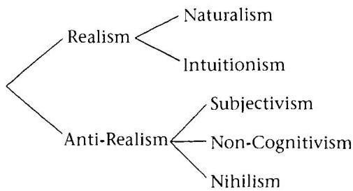
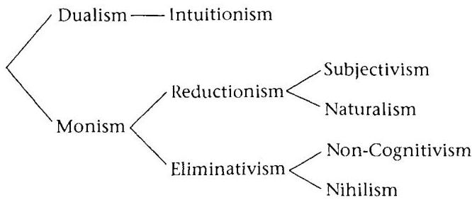

# 1 Introduction

## 1.1 The field of metaethics

The field of *ethics* addresses evaluative questions: these are questions about what is good or bad, or what should or should not be done. An evaluative question calls for an *evaluative statement* as an answer: this is a statement that inherently makes a positive or negative evaluation of something.¹ The following are examples of evaluative statements: ‘One should keep one’s promises’; ‘Happiness is good’; ‘Pol Pot is evil’; ‘Honesty is a virtue’. The last is evaluative because it is part of the meaning of ‘virtue’ that virtues are good.

*Metaethics*, on the other hand, is the branch of philosophy that addresses questions about *the nature of* values and evaluative statements. These questions are generally not themselves evaluative; that is, they do not call for evaluative statements as answers. Here are some examples.

First, there are semantic questions: When I say, ‘It is wrong to eat your pet dog’, what does that mean?² Can ‘wrong’ be defined? Does it refer to a property that dog-eating allegedly has? Does ‘good’ refer to a property that life, happiness, and so on have, and can it be defined?

Second, there are epistemological questions: How, if at all, do we *know* that it is wrong to eat your dog? Can we justify our evaluative beliefs by arguments? Do we need to? Do we have some way of ‘perceiving’ moral values?

Third, there is at least one important metaphysical question: Are there objective values? Or: Are some evaluative statements objectively true?

Fourth, there are questions about moral psychology and rational action: What motivates us to (usually) act in the ways we consider moral? What good reasons, if any, do we have to be moral?

All these are metaethical questions, not ethical questions. Notice that, while they are all about value in one way or another, they are generally not evaluative questions. When I ask, ‘Are there objective values?’ the answer is either ‘There are objective values’ or ‘There are no objective values’. Neither of these answers is itself an evaluative statement; neither expresses a positive or negative judgment about something. When I ask, ‘Do we have some way of “perceiving” moral values?’ the answer is either that we have such an ability or that we do not; neither of these answers is itself a value judgment.

This book is about those sorts of questions. My aim is to show that there are objective values, to explain how we know about them and how they give us reasons for action, and to refute the main competitors to my own views in metaethics.

## 1.2 What is objectivity?

The most discussed metaethical question is that of whether value is ‘objective’. What does it mean for a phenomenon to be ‘objective’?

When a person is aware of something, we call the person a ‘subject’ of awareness. The thing he is aware of we call the ‘object’ of awareness.³ For a feature of something to be ‘objective’ means, roughly, that it is in the object. A ‘subjective’ feature is one that is in the subject.⁴ But what does it mean to be ‘in the subject’? I propose this definition:

$$ F\text{-ness is subjective} = \text{Whether something is } F \text{ constitutively depends at least in part on the psychological attitude or response that observers have or would have towards that thing.} $$

I define an ‘objective’ feature as one that is not subjective.⁵ Consider some examples:

$$ \text{Funniness is subjective, because whether a joke is funny depends on whether people would be amused by it. If no one would find it amusing, then it isn’t funny. This is a point about the meaning of ‘funny’—‘funny’ means something like ‘has a tendency to amuse audiences’.} $$

Similarly, $$ \text{sexiness is subjective, because what is sexy depends on what people would feel attracted to. This, again, is a matter of the meaning of ‘sexy’.} $$

On the other hand, *squareness* is objective: whether an object is square has nothing to do with observers’ reactions to it. To be square, a figure just has to have four equal sides and equal angles. No one has to feel any way about it, think anything about it, or even see it.

What about psychological traits, such as happiness—are they subjective? Not in the sense I intend. Whether a person is happy depends on the attitudes of someone—namely, the person himself—but it does not depend upon the attitudes of observers towards him. Whether you are happy does not depend upon how someone observing you feels.

Another notion to clarify is that of *constitutive dependence*. Consider this example. It is widely believed that for some diseases, a patient’s chances of recovery are affected by his attitude—if a patient takes a positive attitude, this has a beneficial effect on his body, making him more likely to recover. Imagine a disease that is unusually subject to the power of positive thinking: *anyone* who believes he will recover from the disease does so, and anyone who believes he will not recover does not recover. Should we then say that a given individual’s recovery or non-recovery from the disease is ‘subjective’, because whether he recovers depends on whether he believes he will?

No; that is a case of *causal* dependence (the patient’s positive attitude causes his recovery), not constitutive dependence. A subjective property is one that is at least partly constituted by its tendency to elicit a certain reaction from observers. In other words, if $F$-ness is ‘subjective’, then part of what it is for a thing to be $F$ is for observers to have or be disposed to have some particular sort of reaction to it. In the above example, there happens to be a causal connection between positive thinking and recovery; it is not that part of what constitutes one’s recovery from the disease is one’s positive attitude (what would constitute recovery is cessation of whatever the symptoms of the disease are). In contrast, the ability to amuse people is (all or part of) what constitutes being funny. That is why funniness is a subjective property in my sense, while the ‘property’ of recovering from our hypothetical illness is not.

There are controversial cases. Some philosophers think colors are subjective. Some think, for example, that for a thing to be blue is just for it to be disposed to cause a certain sensation (the ‘blue sensation’) in normal humans viewing it in normal conditions. It doesn’t matter for our purposes whether this is right or not. What matters is to understand what is meant by a subjectivist theory. This is a subjectivist theory of color, since it makes the color of a physical object

constitutively dependent on observers' psychological responses to it (counting sensations as 'psychological responses').

## 1.3 Five metaethical theories

Is goodness objective? Moral realists say yes; moral anti-realists say no. There are three forms of anti-realism:

1. Subjectivism (which includes relativism) holds that moral properties are subjective in the sense just defined: for a thing to be good is for some individual or group to (be disposed to) take some attitude towards it. The simplest form of subjectivism states that 'x is good' means 'I approve of x'. Notice that since on this analysis, 'good' applies to whatever the speaker approves of, one person could truthfully say, 'Polygamy is good', while another truthfully says, 'Polygamy is not good'. Their statements do not logically conflict, any more than they would if the first had said, 'I like pickles' and the other said, 'I don't like pickles'.

Other forms of subjectivism substitute other attitudes for approval and other persons or groups for the speaker. Thus, the view that to be good is to be approved by society is a form of subjectivism, as is the view that to be obligatory is to be commanded by God.

2. Non-cognitivism holds that evaluative predicates do not even purportedly refer to any sort of property,$^{6}$ nor do evaluative statements assert propositions. Evaluative statements do not make claims about how the world is, not even about the part of the world that includes human observers. What do they do instead? Some say that they just express speakers' emotions. Thus, 'Stalin was evil' is like 'Boo on Stalin!' Notice that 'Boo!' is not an assertion (it does not say the world is a certain way), not even an assertion about the speaker's feelings, though it can be used to express one's feelings. That is why 'Boo!' is neither true nor false. Similarly, non-cognitivists have traditionally denied that evaluative statements can be true or false.$^{7}$

Another variant of non-cognitivism holds that evaluative statements are more like imperatives. 'Stealing is wrong' is like 'Don't steal!' Notice that, again, 'Don't steal!' is not an assertion and is neither true nor false.

3. Nihilism (a.k.a. 'the error theory') holds that evaluative statements are generally false.$^{8}$ Why? Because evaluative statements assert that things have objective value properties, but in reality there are no such properties. When we say, 'Stalin was evil', we don't just

mean that we don't like Stalin, nor are we just trying to express our hostile feelings about him. We think that there is this property of 'evilness' out there, and he had it, and that's what moral language is about. However, says the nihilist, we are mistaken: there really aren't any properties like that. So our statement is just false. Nothing is either good or evil.

In subsequent chapters we will look at why philosophers have held these views. Right now, it is important to see why the above three positions are the only possible forms of anti-realism. Either 'good' purports to refer to a property—that is, 'x is good' asserts that x has a certain property—or it does not. If it does, then either some things have the property or nothing does, and either the property depends on observers or it doesn't. If we say 'good' doesn't purport to refer to a property at all, then we have ethical non-cognitivism. If we say 'good' purports to refer to a property but nothing has that property, then we have nihilism. If we say 'good' purports to refer to a property, some things have that property, but the property depends on observers, then we have subjectivism. Lastly, if we say 'good' purports to refer to a property, some things have that property, and the property does not depend on observers, then we have moral realism. Those are the only possibilities.

We can make the same point—that there are exactly three possible anti-realist positions—by considering the question of 'objective moral truths'. A statement is objectively true if and only if: it is true and what makes it true is not even partly the attitudes or psychological reactions of observers towards the things the statement is about. Thus, 'Mosquitos have 47 teeth' is objectively true, because it is true and what makes it true is not even partly my or anyone else's reaction to the things (mosquitos) that the statement is about. But 'Jon Stewart is funny' is not objectively true: it is true, but what makes it true is partly the reaction people have towards the thing (Jon Stewart) that the statement is about.

Anti-realists deny the existence of objective moral truths. If a moral statement is not objectively true, then there are just three possibilities: either it is non-objectively (subjectively) true, or it is false, or it is neither true nor false. Hence, we have the subjectivist, nihilist, and non-cognitivist positions, again.⁹

The fact that these are the only three possible forms of anti-realism is important, since it means that if we can refute all of them, we will have established moral realism.

Moral realism comes in two main varieties:

1 Ethical Naturalism holds that there are objective moral properties but that they are reducible. Traditionally, naturalists thought that one could define (that is, explain the meaning of) terms like 'good' using wholly non-evaluative terms. For example, perhaps the good can be defined as whatever most promotes human survival, health, and happiness.

In the late twentieth century, another form of naturalism gained favor, a form which does not claim that the meaning of the word 'good' can be explained in non-evaluative terms, but nevertheless holds that what goodness is can be explained in non-evaluative terms. These modern naturalists compare their view of evaluative properties to scientific theories about the nature of heat, sound, or water. The word 'water' does not mean the same as 'chemical compound each of whose molecules contain two hydrogen atoms and one oxygen atom'. You can see this from the fact that people understood remarks like 'I'd like a glass of water' long before anyone knew modern chemistry. Nevertheless, H₂O is in fact what water is. Similarly, the modern naturalists hold, it will be possible to explain what goodness is using non-evaluative language, although the correctness of this explanation will not follow merely from the meaning of the word 'good'.

In addition to the claim that moral properties are reducible, naturalists typically advance a second important thesis: that moral statements can be justified empirically; that is, they can be justified ultimately on the basis of observation.

2 Ethical Intuitionism holds that moral properties are objective and irreducible. Thus, 'good' refers to a property that some things (perhaps actions, states of affairs, and so on) have, independently of our attitudes towards those things, and one cannot say what this property is except using evaluative language ('good', 'desirable', 'should', 'valuable', and the like).

Intuitionists also have an epistemological thesis, from which their doctrine gets its name: that at least some moral truths are known intuitively. The notion of 'intuition' is subject to interpretation, but at least this much is generally meant: some moral truths are known directly, rather than on the basis of other truths, but not by the five senses (we do not see moral value with our eyes, hear it with our ears, and so on).

Naturalism and intuitionism differ, then, on two fronts: they differ metaphysically, over the issue of whether evaluative properties are reducible; and they differ epistemologically, over the issue of whether moral knowledge is empirical. It would be possible to hold other

forms of realism by combining the naturalist view on one issue with the intuitionist view on the other. But no actual philosopher I know of has held such a view, so I won't discuss it in this book. The philosophers who have held that value is an irreducible property have always appealed to intuition to account for our awareness of this property, and those who have taken value to be reducible to natural (that is, non-evaluative) properties have always tried to account for moral knowledge empirically.

## 1.4 An alternative taxonomy of metaethical views

As the preceding section suggests, metaethical theories are traditionally divided first into realist and anti-realist views, and then into two forms of realism and three forms of anti-realism:

This is not the most illuminating way of classifying positions. It implies that the most fundamental division in metaethics is between realists and anti-realists over the question of objectivity. The dispute between naturalism and intuitionism is then seen as relatively minor, with the naturalists being much closer to the intuitionists than they are, say, to the subjectivists. That isn't how I see things. As I see it, the most fundamental division in metaethics is between the intuitionists, on the one hand, and everyone else, on the other. I would classify the positions as follows:

(I have borrowed terminology from the philosophy of mind literature.) Here, dualism is the idea that there are two fundamentally different kinds of facts (or properties) in the world: evaluative facts (properties) and non-evaluative facts (properties). Only the intuitionists embrace this.

Everyone else is a monist: they say there is only one fundamental kind of fact in the world, and it is the non-evaluative kind; there aren't any value facts over and above the other facts. This implies that either there are no value facts at all (eliminativism), or value facts are entirely explicable in terms of non-evaluative facts (reductionism). Subjectivism and naturalism are thus seen as siblings engaged in a family squabble: they agree that we can reduce goodness to something else; they just disagree over whether that something should include psychological reactions of observers.

Why is my taxonomy more illuminating than the traditional one? Because it puts the question of what exists in the world front and center. Intuitionists differ fundamentally from everyone else in their view of the world. Subjectivists, naturalists, non-cognitivists, and nihilists all agree in their basic view of the world, for they have no significant disagreements about what the non-evaluative facts are, and they all agree that there are no further facts over and above those.[10] They agree, for example, on the non-evaluative properties of the act of stealing, and they agree, contra the intuitionists, that there is no further, distinctively evaluative property of the act.

Then what sort of dispute do the four monistic theories have? I believe that, though this is not generally recognized, their disputes with each other are merely semantic. Once the nature of the world 'out there' has been agreed upon, semantic disputes are all that is left.

Admittedly, I am using 'semantic dispute' in a slightly broader sense than usual. I don't mean that the four monistic theories are notational variants on each other, or that it is only their partisans' different use of words makes them seem to disagree. What I mean is that their disagreement is fundamentally not about what the facts in the world are, but about the mapping between facts in the world and our language and thoughts. This is most obvious in the case of the non-cognitivists, who differ from the other monists over the issue of whether evaluative statements make factual claims. One might say that the subjectivists and naturalists differ over what goodness is—but since they don't disagree over what the non-evaluative facts are, this is really only a dispute over which of the non-evaluative features of things the word (or concept) 'good' denotes. Even the nihilists differ from the reductionists purely on semantic grounds—they differ over whether the commonly accepted non-evaluative facts make evaluative

statements true. Nihilists think that nothing is good because they believe that the meaning of the word 'good' is such as to preclude its denoting any natural or psychological property, while the reductionists disagree with this semantic claim.

The traditional classification initially seems to put the metaphysical question first. The question of whether there are objective values seems to be a metaphysical one—and it would be, if the analysis of 'value' were agreed upon by all parties. But given the views held by many philosophers, the question is partly metaphysical and partly semantic. It turns on (a) whether moral statements assert the existence of objective values, and (b) whether these statements are sometimes true.

None of this bears on the cogency of my central arguments in this book; the plausibility of any of the five metaethical views in no way turns on what one regards as the 'most illuminating' way of classifying them. It does, however, bear on how interesting my central claims are. The fact that intuitionism differs radically from all other theories in metaethics makes it a particularly interesting view, if it can be defended.

## 1.5 A rationalist intuitionism

My position is a form of ethical intuitionism. It is not the only possible form—some intuitionists would disagree with some of what I have to say, though all would agree with the core of it. Here I list the main tenets of my form of rationalistic intuitionism, along with a very brief indication of how I intend to argue for each of them.

First, there is a semantic thesis: Evaluative predicates like 'good' function to attribute objective features to things. This is solely a point about the meanings of words—the semantic thesis does not entail that things have objective value properties; it just states that, when we call a thing 'good', we are saying, whether correctly or not, that it has an objective value property.

This thesis can be established by looking at how we use evaluative language. For instance, we can say, 'If adultery is wrong, then Clinton should be punished'. But we would never say something like, 'If adultery—boo!, then punishing Clinton—yay!' or, 'If don't commit adultery, then punish Clinton!', as the two forms of non-cognitivism mentioned earlier would encourage us to interpret the statement. Nor do we, intuitively, find the inference 'Our society accepts eating animals; therefore, eating animals is not wrong' logically compelling, as one form of subjectivism would lead one to expect. These are just two of many examples that can be given to illustrate that we in fact

use evaluative language in exactly the way that we would if we were attributing objective properties to things.

Second, there is a metaphysical thesis: We are not always wrong when we make value judgments; some things are good and some things are bad. So there are objective values. The justification for this turns on the next point.

Third, there is an epistemological thesis: We are justified in believing some evaluative statements on the basis of rational intuitions. Our knowledge of moral truths is not wholly derived from sensory perception, nor are moral truths all derived from non-moral truths. At least some moral truths are self-evident.

Intuitions, in my sense, are a sort of mental state or experience, distinct from and normally prior to belief, that we often have when thinking about certain sorts of propositions, including some moral propositions. They are the experiences we report when we say a thing is 'obvious' or 'seems true'. Why are we justified in believing propositions on the basis of such experiences? I argue that, in general, it makes sense to assume things are the way they appear, until proven otherwise. All reasoning and judgment proceed upon this principle, and even the arguments of the moral anti-realists rest upon intuitions. I also argue that many of the objections to the use of ethical intuitions would, if consistently applied, require abandoning sensory perception as well and renouncing all knowledge of the world.

Fourth, there are two, closely related theses about the nature of reasons for action: When we have justified evaluative beliefs, those beliefs may constitute good reasons for action, reasons that we have independent of our desires. If I justifiably believe that stealing is wrong, then I have a good reason not to steal my nephew's candy, regardless of how much I might want to, whether I could get away with it, and so on. Furthermore, not only do moral beliefs constitute good reasons for or against certain actions, but they also sometimes constitute our actual motives for action, motives that are qualitatively different from our desires.

These claims conflict with the popular Humean theory of practical reasons, according to which all reasons or motives for action depend upon desires. Suppose I have a desire for coffee ice cream, and I think that going to the store will help me to get some coffee ice cream. Then I have both a good reason and a motivation for going to the store. According to Humeans, all practical reasons and motivations involve desires in that way. So when I decide not to steal the candy because I think stealing is wrong, that also involves some desire of mine. Perhaps I have a desire not to break society's rules, or a desire

not to see my nephew cry, or just a desire not to be a thief. Consequently, if I had different desires, then I would have no reason not to steal—and I could have had different desires while still being perfectly rational.

The Humean theory of practical reasons is my main opponent. But the Humean theory is supported by no good arguments and is implausible in its treatment even of cases not involving morality. I shall argue that Humeans can offer no plausible understanding of the phenomenon of weakness of will, nor can they explain why it is rational to forego immediate satisfactions for the sake of greater long-term benefits, nor can they plausibly explain why morality has the importance for us that it does and why it is rational to act morally.

I shall explain and defend all these points in the succeeding chapters. But many philosophers consider intuitionism incredible on its face. As David Lewis says, I cannot refute an incredulous stare;¹¹ however, I will confront all of the major objections leveled against intuitionism. On examination, these objections prove far weaker than is generally supposed. To take one case, the most popular 'refutation' of intuitionism cites the prevalence of moral disputes as evidence against either the objectivity or the knowability of moral claims. The assumption seems to be that if there were objective moral truths and we had a way of knowing them, then there would be little moral disagreement. Yet our experience with other matters whose objectivity is hardly in dispute provides no support for that prediction. There is, regrettably, quite a bit of dispute about the efficacy of astrology, about whether gun control laws reduce crime, and about who is likely to win the next Super Bowl; yet hardly anyone denies that these matters are 'objective' or that it is possible to have justified beliefs about them. Nor do proponents of the argument from disagreement, as I call it, have a ready explanation for why the mechanisms that lead to disagreements about these issues should not operate in moral matters. Indeed, such proponents seem to operate with a simplistic picture of human psychology in which the unreality of a subject matter is the only possible explanation for a failure of consensus about it.

## 1.6 Background assumptions

There remains one preliminary matter to discuss before proceeding to the case for ethical intuitionism. That is the matter of the general philosophical assumptions I take for granted in this book.

Imagine a pair of scientists debating the merits of the General Theory of Relativity. Scientist A cites Eddington's 1919 observation

of the gravitational bending of light around the sun as evidence in favor of the theory. Scientist $B$ then asks how Eddington knew he wasn't dreaming—or, indeed, how any of us know the senses are a reliable source of information about external reality at all. Does $A$ have to answer this?

No; $B$'s questions are not a fair move in a debate about physics. One reason for this is pragmatic: if we accept $B$'s dialectical demands, then nearly every discussion can be derailed into a debate about philosophical skepticism. It is not that I consider that issue unworthy of discussion; indeed, at another time, I should be happy to discuss it.[12] But a physics discussion is not the place to raise it. If one is worried by general skeptical considerations, one ought to take that up with an epistemologist, and even then only in certain conversational contexts. Of course, if skepticism is actually true, then General Relativity is not justified, by Eddington's observations or anything else. But when we are talking about physics, we tacitly assume the falsity of skepticism. Without that, we would never make any progress.

Going beyond pragmatic considerations, many responses to philosophical skepticism have been articulated and defended. It is reasonable, even without having examined the issue in detail, to think that some response to skepticism in epistemology is correct, one that enables us to have at least reasonable beliefs about the physical world, and it probably doesn't matter for the purposes of doing physics exactly what that response is.

I expect the reader to agree so far. After all, hardly anyone in real life would think to argue in the way I imagined scientist $B$ arguing. A similar rule applies in metaethical discussions. We should not consider it a fair move, for example, for someone arguing against ethical intuitionism to deploy general skeptical arguments. In other words, in this discussion, I may assume that we are justified in believing most of the things we normally take ourselves to be justified in believing, outside the area of ethics. I may assume that we are justified in believing that rocks exist, that we are conscious, that the earth will continue to exist next week, that $4 + 1 = 5$, and that no object can be both completely red and completely blue. Thus, if some particular argument against intuitionism can be shown to be merely a special case of a more general argument impugning our knowledge of those sorts of things, then I may set that argument aside as not relevant to the current discussion.

What holds for general philosophical skepticism holds equally for general ('metaphysical') anti-realism. That is, just as I don't need, in defending the possibility of moral knowledge, to answer arguments

against the possibility of knowledge in general, I don't need, in defending the objectivity of value, to answer arguments against the possibility of objective reality in general.

Readers afflicted with general skeptical or anti-realist sentiments may, then, wish to regard the main theses of this book as conditional: if there is, in general, an objective reality, and we can know things about it, then there are also objective evaluative truths, which we can know something about. That is, there is no special problem for moral objectivity and knowledge.

.